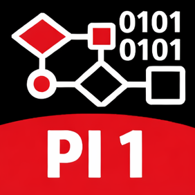

# 📘 Projeto Integrador I

Repositório com os exemplo das aulas apresentados em sala.

---

## 📚 Conteúdo das aulas

### 🟢 Módulo 1 — Fundamentos

- [01 — Introdução ao Python](./python/a01-intro.py)
- [02 — Comando input()](./python/a02-input.py)
- [03 — Comando if](./python/a03-if.py)
- [03 — Exercícios if](./python/a03-if-exercicio.py)
- [04 — Exercícios](./python/a04-exercicio.py)
- [04 — Comando while](./python/a04-while.py)
- [05 — Listas](./python/a05-listas.py)

---

## 📌 Como usar

- Clique na aula desejada
- O slide abrirá direto no navegador
- Você também pode baixar o PDF

---

## ⚠️ Observações

- Este material é de apoio às aulas
- Os exemplos e explicações completas são apresentados em sala

---

## 👨‍🏫 Professor Parisotto

Material desenvolvido para uso em aula.
# PI1-ProjetoIntegrador1
Material didádico para a disciplina de PI1 Projeto Integrador 1
